## Flex

1차원 레이아웃 구조를 작업할 때 사용한다. x축에 대한 1차원 레이아웃은 수평, y축에 대한 1차원 레이아웃은 수직을 나타낸다. 즉, 우리는 수평 또는 수직 레이아웃을 위해 flex를 사용한다. 1차원이라는 것은 축을 1개를 사용한다는 것을 의미한다.

<br>

`display: flex`를 적용한 곳을 **flex container**라고 하고, 그 하위 요소들을 **flex items**라고 부른다.

<br>

수평 정렬 시, **flex** 또는 **inline-flex**를 사용할 수 있다. 우리는 주로 **flex**를 많이 사용하는데, **inline-flex**와는 어떤 차이가 있을까?

- **flex**: flex container가 block 요소의 특징을 가진다.

  - 수직 정렬, 가로 너비를 최대로, 세로 너비를 최소로 하려는 특징
  <div style="width: 55%; padding: 1rem 0 2rem;" >
    
  </div>

- **inline-flex**: flex container가 inline 요소의 특징을 가진다.
  - 수평 정렬, 가로 세로 너비를 최소로 하려는 특징
  <div style="width: 55%; padding: 1rem 0 2rem;" >
    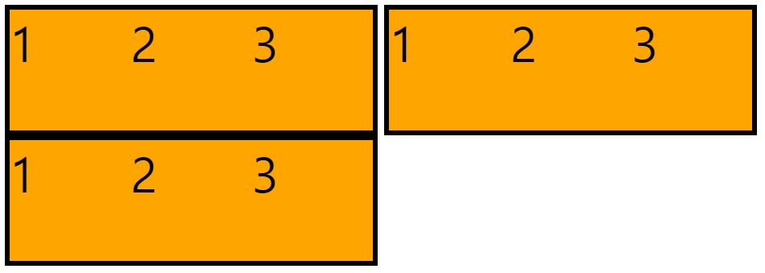
  </div>

<br>
<br>

<aside>
💡 <strong>flex container</strong>와 <strong>flex items</strong>에 적용할 수 있는 속성들에 대해 알아보자.
</aside>

<br>

먼저 **flex container**에 적용할 수 있는 속성부터 살펴보자.

### flex-direction

- `row`: 왼쪽에서 오른쪽으로 수평 정렬된다. (기본 값)
- `column`: 위에서 아래로 수직 정렬된다.
- `row-reverse`: 오른쪽에서 왼쪽으로 수평 정렬된다.
  <div style="width: 55%; padding: 1rem 0 2rem;" >
    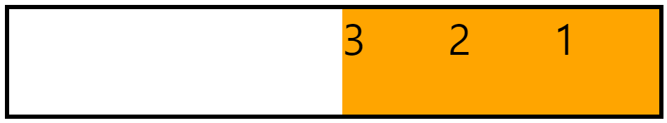
  </div>
- `column-reverse`: 아래에서 위로 수직 정렬된다.
  <div style="width: 55%; padding: 1rem 0 2rem;" >
    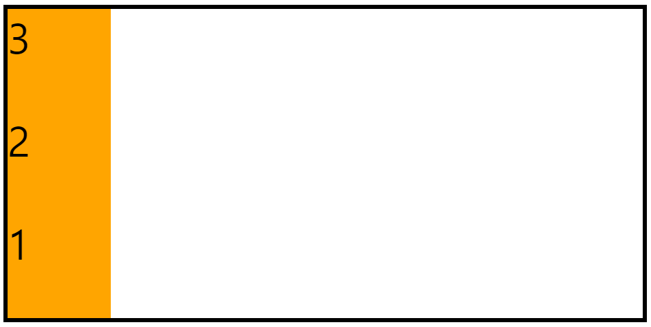
  </div>

### flex-wrap

줄바꿈과 관련된 속성이다.

```css
.container {
  width: 400px;
  border: 4px solid;
  display: flex;
  flex-wrap: nowrap;
}
```

- `nowrap`: 줄바꿈 처리 되지 않는다. (기본 값)
  <div style="width: 40%; padding: 1rem 0 2rem;" >
    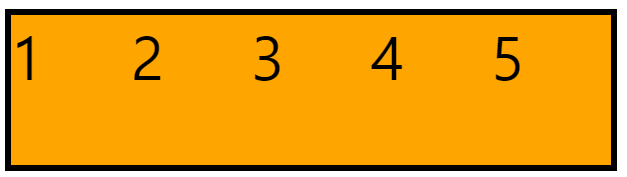
  </div>
- `wrap`: 줄바꿈 처리가 된다.
  <div style="width: 40%; padding: 1rem 0 2rem;" >
    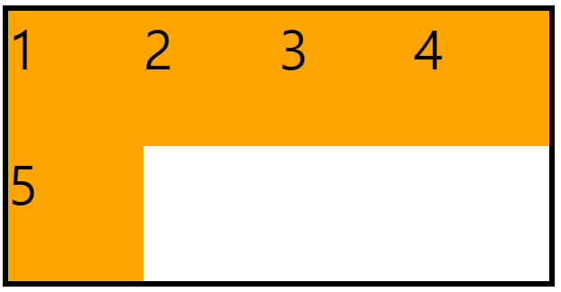
  </div>
- `wrap-reverse`: 반대 방향으로 줄바꿈 처리 된다.
  <div style="width: 40%; padding: 1rem 0 2rem;" >
    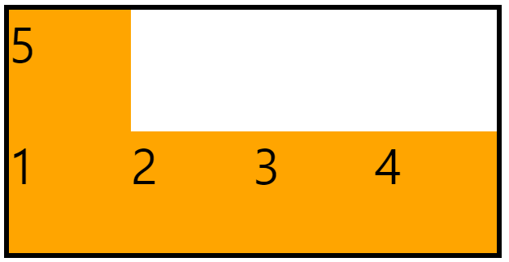
  </div>

### justify-content

x축(주축)을 기준으로 정렬된다.

- `flex-start`: flex container가 시작되는 지점
- `flex-end`: flex container가 끝나는 지점
- `center`: flex container 가운데 지점
- `space-between`: 첫번째 item을 flex-start에, 마지막 item을 start-end에 배치하고 나머지 item을 남은 공간에 균등히 배치함
  <div style="width: 50%; padding: 1rem 0 2rem;" >
    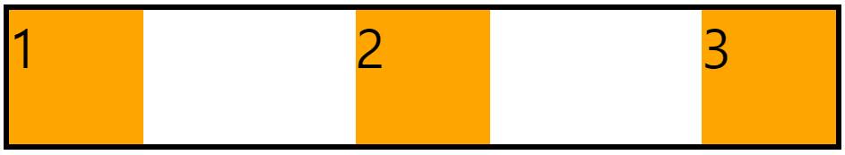
  </div>
- `space-around`: 각 item에 왼쪽 오른쪽에 균등하게 공간을 분배해서 배치함
  <div style="width: 50%; padding: 1rem 0 2rem;" >
    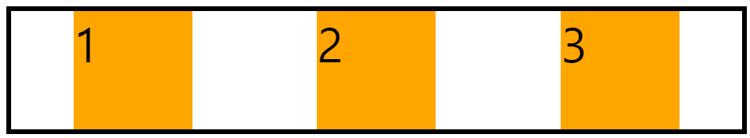
  </div>

### align-items

1줄일 때 사용한다. y축(교차축)을 기준으로 정렬된다.

- `stretch`: item에 height가 지정되지 않으면 flex container의 height와 동일하게 배치됨 (기본 값)
  - 단, flex item에 height가 지정된 경우에는 영향을 주지 않음
- `flex-start`: flex container가 시작되는 지점
- `flex-end`: flex container가 끝나는 지점
- `center`: flex container 가운데 지점
- `baseline`: 글자의 기준선을 맞추어 배치됨

### align-content

2줄 이상일 때 사용할 수 있다. y축(교차축)을 기준으로 정렬된다.

기본 값은 `stretch`이고, `flex-start`, `flex-end`, `center`, `space-between`, `space-around`를 사용하여 원하는 대로 정렬할 수 있다.

<div style="width: 40%; padding: 1rem 0 2rem; margin: 0 auto;" >
  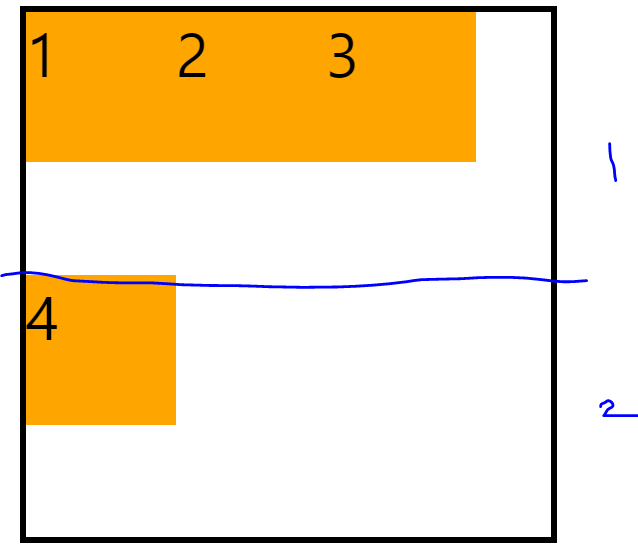
</div>

<br>
<hr>
<br>

다음으로 **flex items**에 적용할 수 있는 속성들에 대해 알아보자.

### flex-grow

증가되는 너비 비율을 설정한다. 기본 너비가 설정되어 있는 경우, 기본 너비의 나머지 너비를 기준으로 비율을 설정하게 된다.

<div style="width: 50%; padding: 2rem 0 1rem; margin: 0 auto;" >
  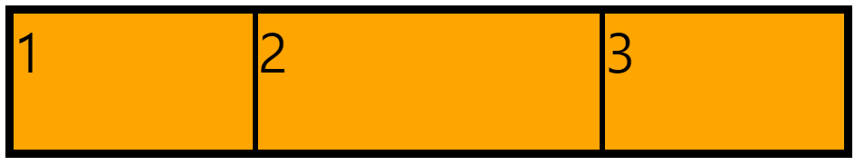
</div>

```css
.container {
  border: 4px solid;
  display: flex;
}

.container .item {
  width: 100px;
  height: 100px;
  background-color: orange;
  font-size: 40px;
  border: 2px solid;
  flex-grow: 1;
}

.container .item:nth-child(2) {
  flex-grow: 2;
}
```

### flex-shrink

요소의 감소 너비 비율을 설정하게 된다. 기본 값은 1이다. 0을 넣어주면 아래와 같이 요소의 너비가 감소하는 것을 방지할 수 있다.

<div style="width: 35%; padding: 2rem 0 1rem; margin: 0 auto;" >
  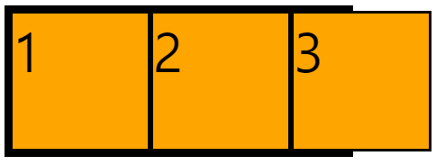
</div>

```css
.container {
  width: 250px;
  border: 4px solid;
  display: flex;
}

.container .item {
  width: 100px;
  height: 100px;
  background-color: orange;
  font-size: 40px;
  border: 2px solid;
  flex-shrink: 0;
}
```

### flex-basis

요소의 기본 너비를 지정할 수 있다. 기본 값은 auto이다. 숫자를 지정해주면 item 자체에 지정한 너비는 적용되지 않는다. 요소의 기본 너비를 0으로 지정한다면, `flex-grow`로 너비 증가 비율을 그 자체로 사용할 수 있다.

<div style="width: 50%; padding: 2rem 0 1rem; margin: 0 auto;" >
  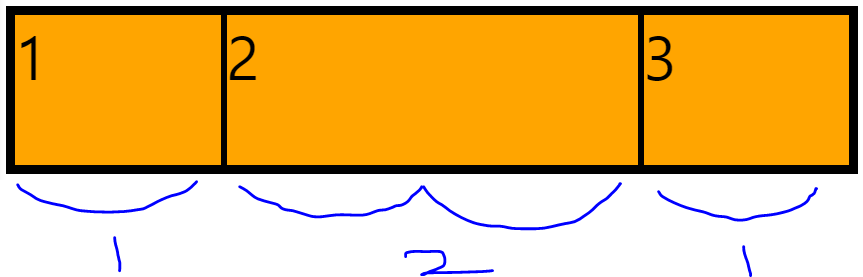
</div>

```css
.container {
  border: 4px solid;
  display: flex;
}

.container .item {
  width: 100px;
  height: 100px;
  background-color: orange;
  font-size: 40px;
  border: 2px solid;
  flex-basis: 0;
  flex-grow: 1;
}

.container .item:nth-child(2) {
  flex-grow: 2;
}
```

### flex

`grow shrink basis`의 단축 속성이다. 기본 값은 `flex: 0 1 auto`이다. basis 값을 생략한다면 기본 값인 auto가 아닌 0이 들어가기 때문에 주의해야 한다.

### order

flex item의 순서를 정해주는 속성이며, 기본 값은 0이다. 숫자가 클수록 순서가 뒤로 가게 된다. 음수 값도 적용할 수 있다.

<div style="width: 50%; padding: 2rem 0 1rem; margin: 0 auto;" >
  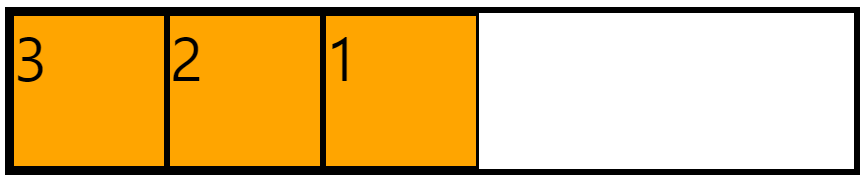
</div>

```css
.container {
  border: 4px solid;
  display: flex;
}

.container .item {
  width: 100px;
  height: 100px;
  background-color: orange;
  font-size: 40px;
  border: 2px solid;
}

.container .item:nth-child(1) {
  order: 1;
}

.container .item:nth-child(3) {
  order: -1;
}
```

### align-self

align-items의 속성을 상속받지 않고 개별적으로 지정하고 싶을 때 사용한다. 기본 값은 auto이기 때문에 따로 지정하지 않는 경우 align-items에 설정된 값을 상속받는다.

<div style="width: 35%; padding: 2rem 0 1rem; margin: 0 auto;" >
  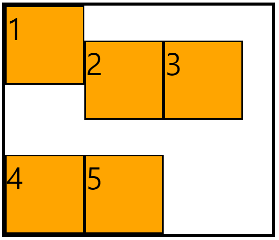
</div>

```css
.container {
  width: 350px;
  height: 300px;
  border: 4px solid;
  display: flex;
  flex-wrap: wrap;
  align-items: flex-end;
}

.container .item {
  width: 100px;
  height: 100px;
  background-color: orange;
  font-size: 40px;
  border: 2px solid;
}

.container .item:nth-child(1) {
  align-self: flex-start;
}
```

<br>

### References

- [프로그래머스 프론트엔드 데브코스 3기](https://school.programmers.co.kr/)

<br>
