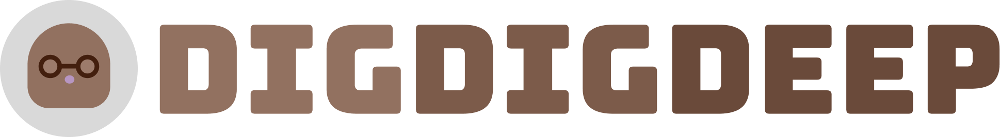

<aside>
🧑🏻‍💻 2023.1.4 - 1.20까지 약 3주간 진행된 팀프로젝트 with <strong>유리팀</strong>
</aside>

<br>

## 👀 프로젝트를 시작하며

이번 프로젝트는 프론트엔드 4명으로 구성되어 기획, 디자인, 개발까지 진행했다. API는 강사님께서 만들어주신 것을 사용해야 했다. 개인적으로는 프로젝트 시작과 함께 회사를 다니게 되었다. 그래서 다른 팀원들보다 시간이 한정적이었고, 이게 민폐가 되진 않을까 걱정이 많았다. ㅠㅠ 사전에 팀원들에게 양해를 구하고 시작했던 프로젝트였기에 책임감이 더 컸다. 적은 시간이지만 그 시간 안에서 최선을 다해야겠다고 다짐하며 프로젝트를 시작했다.

<br>

## 📃 기획

평소에 하던 팀 스크럼 시간에 미리 기획에 대한 얘기를 나눈 적이 있다. 이 때, 공통으로 나온 키워드가 `스터디`였다. 우리팀은 이 키워드를 중심으로 브레인스토밍을 하게 되었다.

### 주제 선정 회의

피그잼을 사용하여 주제에 대한 각자의 의견을 남기고 이를 바탕으로 회의를 진행했다. 이번에 처음으로 피그잼을 사용해보았는데, 실시간으로 의견을 나누는데 있어 효율적이라고 생각한다.

우리에게 주어진 API는 소셜 네트워크 서비스를 구현과 관련되어 있어, 주제 선정시 약간의 제약이 있었다. 이러한 상황을 최대한 고려해서 주제를 선정하게 되었다.

### 프로젝트 주제

데브코스에서의 큰 주제가 `React 혹은 Vue.js를 이용하여 소셜 네트워크 서비스`였고, 우리는 아래와 같은 주제를 선정하게 되었다.

> 커뮤니케이션을 통한 학습을 제공하는 개발자 전용 SNS, **DigDigDeep (디그디그딥)** 커뮤니케이션을 통한 학습을 제공하는 개발자 전용 SNS, **DigDigDeep (디그디그딥)**

### 서비스 컨셉

우리는 아래와 같은 서비스 컨셉을 적용시켜 프로젝트를 진행하기로 했다.

<aside>
🦔 <strong>개발자들이 <em>그라운드</em>에서 <em>디깅</em>을 통해 지식이 깊어질 수 있는 커뮤니티</strong>

- _그라운드_: 하나의 주제와 관련된 포스트를 의미한다.
- _디깅_: 댓글을 남기는 행위를 의미한다.
</aside>

<br>

## 🎨 디자인

이번 프로젝트에서 내가 한 역할 중 가장 비중이 큰 파트이다. 뛰어나진 않지만 그동안의 경험을 바탕으로 디자인을 잘 할 수 있지 않을까? 라는 생각이 들었다. 그래서 내가 디자인을 맡겠다고 선언(?)하고 피그마를 사용하여 서비스 로고와 프로토타입을 구현했다.

### 로고

<div style="width: 70%; padding: 1rem 0; margin: 0 auto;" >
  
</div>

땅을 파면 팔 수록 깊어지는 것처럼 사용자들이 서비스 내에서 지식을 나누면 나눌수록 깊이 있는 학습이 가능하다는 의미를 담았다. 심볼은 학습하는 두더지이며, 메인 컬러는 브라운 계열을 사용했다.

### 프로토타입

회의를 하며 만든 와이어프레임을 기반으로 모바일 디자인을 먼저 시작했다. 디자인을 할 때 모바일을 먼저 하고 웹을 하는 것이 더 편하다고 한다. 모바일이 더 화면이 작기 때문에 레이아웃 잡는 것이 까다롭기 때문이라고 생각한다. 그래서 일단 모바일 기준으로 디자인을 완성했다. 퇴근하고 3일은 디자인만 한 것 같다 … 😳  ~~(이 때 너무 개발하고 싶었다. ㅋㅋ)~~ 이후 웹 버전은 로그인/회원가입 부분을 제외하고는 모바일 버전을 거의 유지하는 레이아웃으로 진행했다. 디자인에 많은 열정을 쏟기에는 시간이 너무 부족했다 ….

<br>

## 💻 개발

우리는 주요 기능들을 리스트로 정리하고, 각자 구현하고 싶은 기능을 선택했다. 나는 디자인 작업을 끝내고 나서 부터 기능 개발을 시작했다. 내가 맡은 주요 기능은 **알림 기능과 포스트 에디터 기능**이었다.

### 기술 스택

타입스크립트 기반 리액트와 styled-components를 사용하였다. 나는 프로젝트에서 리액트나 styled-components는 사용해 본 경험이 있는 반면, 타입스크립트는 없었다. 타입스크립트를 깊게 공부해보지 않아서 사용하는 것에 두려움이 있었다.. 멘토님와 커피챗에서 타입스크립트 도입에 대한 고민을 나눴는데, 멘토님께서 처음 도입해보는 것이니까 타입을 지정해보는 것 만으로도 의미가 있다고 해주셨다. 그래서 우리는 일단 타입을 지정해보는 수준으로 타입스크립트를 사용하게 되었다.

### 기능 구현

1. **알림 기능**

   알림 종류가 총 3가지 (좋아요, 댓글, 팔로우)이었다. `GET`해온 알림들을 종류에 따라 다르게 보여주었다.

   - 좋아요: `사용자`님이 내 그라운드를 좋아합니다.
   - 댓글: `사용자`님이 내 그라운드를 디깅했습니다.
   - 팔로우: `사용자`님이 나를 팔로우했습니다.

   여기까지는 문제가 없었는데, 내가 처리하지 않은 부분들이 있었다. 앞으로는 이런 예외 처리에 대해 더 꼼꼼히 처리 해야겠다고 생각했다.

   - 자기 자신에게 알림을 보내는 경우
     - `filter`로 현재 로그인 되어 있는 유저와 알림을 보낸 유저가 같지 않을 때만 보여주도록 처리했다.
   - 알림이 하나도 없는 경우
     - `notifications.length`가 0인 경우로 받아 처리해주었다.

   ```tsx
   return (
     <List>
       {notifications.length === 0 ? (
         <Text>아무 알림도 오지 않았어요 ... 🦔</Text>
       ) : (
         notifications
           .filter(notification => notification.author._id !== user._id)
           .map(notification => (
             <Notification key={notification._id} {...notification} />
           ))
       )}
     </List>
   );
   ```

   알림 읽음 기능 처리가 제일 어려웠던 것 같다. 팀원들에게 모르는 부분을 도움 받아 아래와 같이 해결할 수 있었다.

   `boolean` 값인 `isSeen`으로 알림을 읽음 여부를 확인할 수 있었는데, API가 알림을 읽었다면 모든 알림의 `isSeen` 값을 변경해주는 역할을 했다. 그래서 `useEffect`로 처음에 화면이 로딩되고 `isSeen`이 하나라도 `false`면 알림이 있다는 것을 아이콘으로 표시해주었다.

   <br>

2. **새 포스트 생성 기능**

   포스트 데이터가 제목과 바디가 구분되지 않아서 객체 형태로 구분해서 넘겨주었다.

   ```tsx
   title: { // API 데이터
   	title: '제목',
   	body: '바디',
   }
   ```

   `input`에 입력하는 값을 서버에 넘겨주어야했는데, 헤더 컴포넌트와 에디터 컴포넌트가 분리되어 있어서 `e.target.value`를 어떻게 넘겨줘야할지 어려웠다 … 이 과정에서 커스텀 훅을 만들어서 상태값과 이벤트핸들링 함수를 원하는 곳에서 불러서 사용했다. 커스텀 훅은 컴포넌트 트리를 통해 전달되어 생성하는 것이 아닌 각 컴포넌트에서 독립적으로 상태를 생성할 수 있다는 장점이 있기 때문이다.

   즉, 에디터 컴포넌트에서는 상태를 set해주고, 헤더 컴포넌트에서는 커스텀 훅으로부터 상태를 받아와서 서버로 넘겨주는 방식으로 해결할 수 있었다 !!!

   이미지 첨부 기능도 처음 구현해봐서 접근 방식이 떠오르지 않았던 것 같다. 팀원 중에 프로필 이미지 수정 기능을 구현한 팀원이 있어서 도움을 받을 수 있었다.

   이미지는 `Blob`이라는 타입을 사용해야 한다는 것을 알게 되었다. 해당 타입을 `src` 속성에 어떻게 넘겨줄까 에 대한 어려움이 있었는데, `URL.createObjectURL(object)`를 사용해서 문제를 해결할 수 있었다.

   `createObjectURL`을 활용하면 `Blob` 객체의 URL 주소값으로 이미지를 불러 올 수 있다. 해당 주소는 실제 서버에는 존재하지 않고, 브라우저 내에서만 사용 가능한 URL이다.

   이런 내용을 바탕으로 아래와 같이 기능을 구현했다.

   <br>

3. **내가 작성한 포스트 수정 기능**

   `useEffect`에서 해당 포스트 정보를 불러와 각 `title, body, image` 상태에 set해주었다. 그리고 편집한 내용을 다시 `PUT`해주는 형식으로 구현했다.

<br>

## 👨‍👨‍👧‍👧 협업

디스코드로 매일 스크럼을 하면서 각자 진행 상황을 공유하고, 어려움은 없었는지 얘기를 나눴던 시간이 프로젝트 전체에서 제일 중요한 부분이라고 생각했다. 어쩌면 비슷한 어려움을 겪었거나 겪고 있을 수 있기 때문에 이렇게 서로의 상황을 공유하는 것이 필요한 것 같다.

그리고 git과 github를 활용해서 협업이 잘 이루어진 것 같다. 가끔 브랜치 문제가 발생하긴 했지만, 그 때마다 천천히 git log를 보고 해결 방법을 찾아 브랜치가 꼬이지 않도록 처리했다.

짧은 시간임에도 팀원 모두가 각자 자신의 역할에 최선을 다해줘서 너무 좋은 결과가 나온 것 같다!!!

<br>

## 😽 프로젝트를 마치며

타입스크립트 타입을 지정하는 것도 처음에는 어려웠는데, 여러 컴포넌트를 구현해보면서 조금씩 익숙해진 것 같다! 커스텀 훅도 처음 만들어보고, API 호출하는 것도 전보다 능숙해 진 것 같다.

중간 발표와 최종 발표에도 참여하며 개발하고 있는 서비스에 대한 이해도를 더 높일 수 있었고 전달력도 키울 수 있었다. 그리고 데브코스에 와서 팀장을 연속으로 하고 있는데, 팀장으로서 노력한 점이 있다면 최대한 모두의 의견을 듣고 맞춰나가는 과정에서 마음 상하는 일이 없도록 노력한 것 같다 🙂 부족하지만 더 성장할 수 있었던 기회였던 것 같다.

유리팀 각자 잘하는 부분이 달라서 합이 너무 좋았던 것 같아요 !!! 최고 .. 다들 고생하셨습니다 🥰

<br>

### 결과

- [DigDigDeep](https://dig-dig-deep.vercel.app/) <br>
- [FEDC3_DigDigDeep_Yuri](https://github.com/prgrms-fe-devcourse/FEDC3_DigDigDeep_Yuri)

<br>
