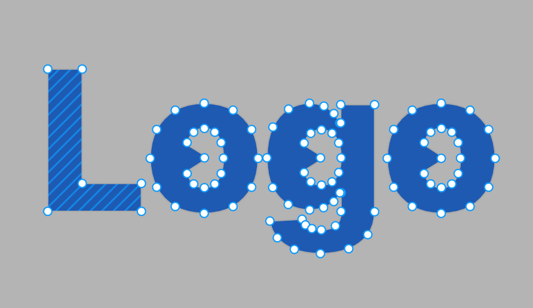
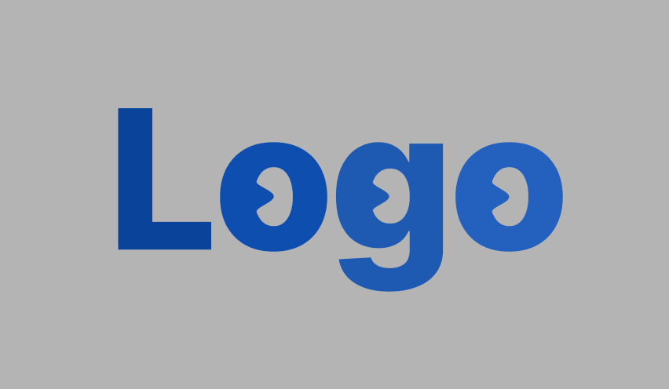

## 설치

피그마는 웹 기반 브라우저이지만, 계속 사용할 예정이라면 데스크탑 앱으로 다운해서 사용하는 것을 추천!

 

## 기본적인 사용법

### 🧑🏻‍💻 개발자 관점

디자인된 피그마 파일을 보고 프론트엔드 개발자가 활용할 수 있는 방법들!

<strong>기능</strong>

### 1. **요소의 CSS 속성 참고하기**

원하는 요소를 선택하고 `Inspect` 탭에서 CSS 코드를 확인할 수 있다. 상황에 맞게 수정해야하는 경우도 분명 존재하기 때문에 이 코드를 전부 그대로 사용하는 것은 추천하지 않는다.

  

### 2. **사용된 이미지 저장하기**

원하는 이미지를 선택해서 원하는 포맷과 배율로 `export`할 수 있다. 전체 이미지를 `export`하고 싶다면 `file > export`를 클릭하여 전체 이미지를 저장할 수 있다.

  

### 3. **코멘트를 활용해서 소통하기**

원하는 위치에 코멘트를 작성할 수 있다. 작성 후 해결이 완료된 코멘트는 체크 버튼을 클릭하여 닫을 수 있다. 혹시 나중에 해결된 코멘트도 보고 싶다면 아래의 설정에서 `show resolved comments`를 선택하면 된다.

  

 

### 🎨 디자이너 관점

피그마를 사용해서 실제 디자인을 해야할 때 기본적으로 알면 좋은 것들!

<strong>디자인</strong>

### 1. 기본적인 UI 만들기

기본 도구를 이용하여 간단한 버튼, 텍스트, 아이콘 등을 만들 수 있다. 특히, 펜 툴을 사용하여 좀 더 정밀하고 원하는 모양을 만들 수 있다.

  

### 2. **컴포넌트로 만들어서 재사용성 높이기**

반복되는 요소를 컴포넌트로 만들자. 그럼 하나씩 다 복붙할 필요가 없고 간격도 하나하나 조정할 필요가 없다.

  

### 3. 픽셀에서 벡터로 변환하여 원하는대로 디자인하기

일러스트레이터와 기능이 유사하다. 보통 로고를 만들거나, 아이콘을 만들 때 사용할 수 있다.

  

텍스트

  

텍스트 → 벡터화 (flatten or outline stroke)

  

변형 후 완성

 

<strong>프로토타입</strong>

  모든 페이지 디자인이 끝나면 이제 프로토타입을 만든다. 프로토타입은 실제 개발이 되었을 때와 같이 미리 서비스를 확인해보며 사용성 측면에서 테스트 해볼 수 있게 해준다.
  보통 원하는 요소를 클릭했을 때 다음 페이지로 이동되도록 요소 - 페이지 연결을 해준다. 피그마에서는 클릭 이벤트 뿐 아니라 여러가지 다양한 이벤트를 제공하기 때문에 원하는 요소에 원하는 이벤트를 연결해주면 된다. 또, 화면 전환 방식 애니메이션도 선택이 가능하다.

  

  

   

  <aside>
    💡 <strong>요즘 자주 사용되는 레이아웃인 가로 스크롤 만들기</strong>
         컴포넌트를 만들고 그 안에 인스턴스를 원하는 만큼 만든다. 컴포넌트 가로 세로 영역을 잡아주고 prototypes 탭에 들어간다. 거기서 overflow scorlling을 horizontal로 설정해주면 끝!
  </aside>

 

### 📌 자주 쓰는 단축어

1. `command + 마우스 휠(+/-)`: 화면 확대 축소
2. `shift + 크기 조절`: 이미지 비율 유지하면서 확대 축소
3. `option`: 요소에 마우스 hover 한 상태이면, 그 요소를 기준으로 몇 픽셀만큼 떨어져 있는지 수치가 나옴
4. `option`: 요소 복사 붙여넣기 한번에 가능
5. `shift + option`: 복사 붙여넣기인데, 가로 혹은 세로 라인 유지 가능
6. `command + [/]`: 요소 뒤/앞으로 보내기

 

### References

- [Figma](https://www.figma.com/downloads/)

 
