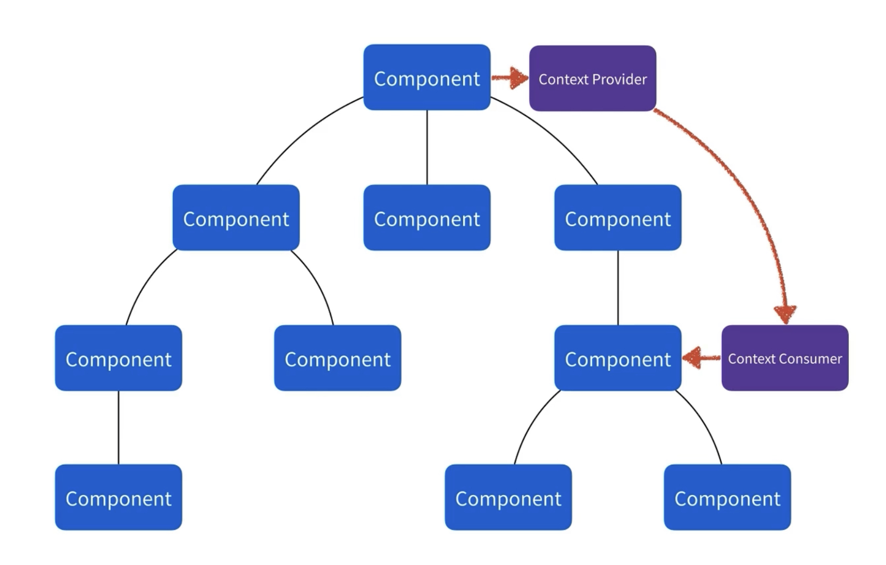
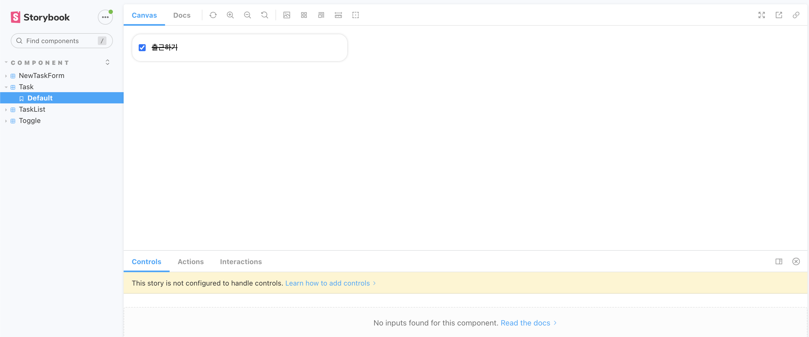

## Context API

컴포넌트는 트리 구조로 이루어져 있다. 만약 최상위 컴포넌트에서 가장 하위 컴포넌트로 prop을 넘기고 싶다면 어떻게 해야할까? 하위 컴포넌트를 찾을 때 까지 계속 넘겨주어야 할 것이다. 이런 경우를 **Prop Drilling**이라고 한다. Context API는 이를 해결해줄 수 있다.

### 구성

Context API는 데이터를 제공해줄 *Context Provider*와 데이터를 받을 *Context Consumer*가 있다. **데이터는 Context Provider가 관리하고, Context Consumer는 데이터를 받아서 처리만 해주면 된다.**

<div style="width: 75%; padding: 1rem 0 2rem; margin: 0 auto;" >
  
</div>

<br>

## Context API 실습하기 with Storybook

### Storybook

UI 컴포넌트를 모아서 문서화하고 보여주는 오픈소스 툴이다. 개발자가 컴포넌트를 Storybook에 등록해두면 어떤 컴포넌트가 있는지 쉽게 확인할 수 있다.

[storybook 설치 방법](https://storybook.js.org/docs/react/get-started/install) <br>
[Storybook Tutorials - 리액트에서 적용한 예시](https://storybook.js.org/tutorials/intro-to-storybook/react/ko/get-started/)

<br>

아래 명령어로 프로젝트에 적용할 수 있다.

```powershell
npx storybook init
```

설치가 되면 `.storybook` 디렉터리와 `stories` 디렉터리가 생성된다.

- `.storybook`: 설정 파일이 모여있는 곳
- `stories`: 등록된 story(컴포넌트)가 모여있는 곳

설치가 되고 나면 아래 명령어로 `localhost:6006` 포트에서 확인할 수 있다.

```powershell
npm run storybook
```

### 컴포넌트를 Storybook에 등록하는 방법

TODO List의 기본이 되는 `Task` 컴포넌트를 아래와 같이 작성했다. 이 컴포넌트를 스토리북에 등록해보자.

```jsx
const Task = ({ content, complete, ...props }) => {
  return (
    <ListItem {...props}>
      <input type="checkbox" checked={complete} />
      <Content complete={complete}>{content}</Content>
    </ListItem>
  );
};

export default Task;
```

`src/stories` 디렉토리에 `Task.stories.js` 파일을 생성한 후, 아래와 같이 코드를 작성해준다.

```jsx
import Task from '../components/Task';

export default {
  title: 'Component/Task',
  component: Task,
};

export const Default = () => {
  const task = {
    content: '출근하기',
    complete: true,
  };
  return <Task content={task.content} complete={task.complete} />;
};
```

먼저 등록할 컴포넌트 파일을 `import` 하고 해당 컴포넌트 이름으로 `export` 해준다. 그리고 기본 값으로 보여질 부분을 `Default` 함수에서 `return` 해주면 된다. `props`의 기본 값들을 세팅해주고 `npm run storybook` 명령어로 등록된 컴포넌트를 확인해보자.

<div style="width: 90%; padding: 1rem 0 2rem; margin: 0 auto;" >
  
</div>

`Task` 컴포넌트가 잘 등록된 것을 확인할 수 있다.

### Context API 사용하기

컨텍스트를 사용하면 부모 컴포넌트가 그 아래의 전체 트리에 데이터를 제공할 수 있다.

컨텍스트는 다음 단계를 통해 사용할 수 있다.

**1. 컨텍스트를 만든다.**

```jsx
import { createContext } from 'react';

const TaskContent = createContext();
```

**2. 컨텍스트를 사용한다.**

```jsx
import { createContext, useContext } from 'react';

const TaskContent = createContext();

export const useTasks = () => useContext(TaskContent);
```

**3. 컨텍스트를 제공한다.**

```jsx
import { createContext, useContext } from 'react';

const TaskContent = createContext();

export const useTasks = () => useContext(TaskContent);

const TaskProvider = ({ children }) => {
  const [tasks, setTasks] = useLocalStorage('tasks', []);

  const addTask = content => {
    setTasks([...tasks, { id: v4(), content, complete: false }]);
  };

  const updateTask = id => {
    setTasks(
      tasks.map(item =>
        item.id === id ? { ...item, complete: !item.complete } : item,
      ),
    );
  };

  const removeTask = id => {
    setTasks(tasks.filter(item => item.id !== id));
  };

  return (
    <TaskContent.Provider value={{ tasks, addTask, updateTask, removeTask }}>
      {children}
    </TaskContent.Provider>
  );
};
```

```jsx
import TaskProvider from './contexts/TaskProvider';

function App() {
  return (
    // consumer
    <TaskProvider>
      <div>TEST</div>
    </TaskProvider>
  );
}

export default App;
```

### 컨텍스트를 사용하기 전에 …

일부 `props`를 여러 depth로 전달해야한다고 해서 무조건 컨텍스트를 사용하는 것은 아니다. 컨텍스트를 사용하기 전에 고려해야 할 몇 가지 대안은 다음과 같다.

1. `props`를 전달하는 것부터 시작하기
2. 컴포넌트를 뽑아내고 이를 `children`으로 JSX에 전달하기

<br>

### References

- [프로그래머스 프론트엔드 데브코스 3기](https://school.programmers.co.kr/)
- [react/passing-data-deeply-with-context](https://react.dev/learn/passing-data-deeply-with-context)

<br>
